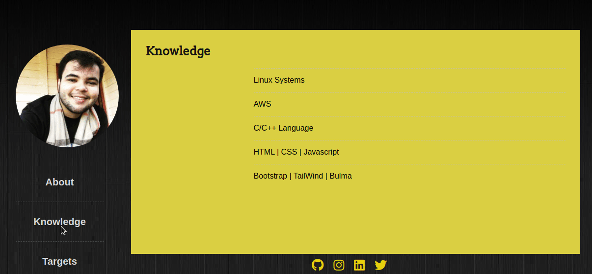

<h1 align='center'>CSS-trainning</h1>

Páginas web contruídas sem nenhum framework de estilização com o intuito de aprimorar conhecimentos com CSS. Especificamente **posicionamento**, propriedades de **FlexBox, Grid e Float** foram amplamente utilizadas para o desenvolvimento.   Além disso, cada página contém um pouco da minha experiência, tecnologias de estudo/trabalho e experiência profissional. Funcionando como um currículo web.
